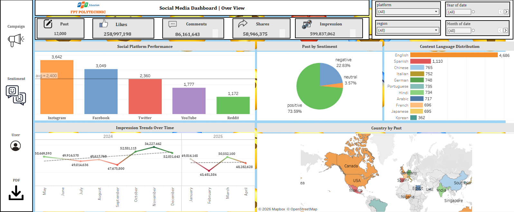
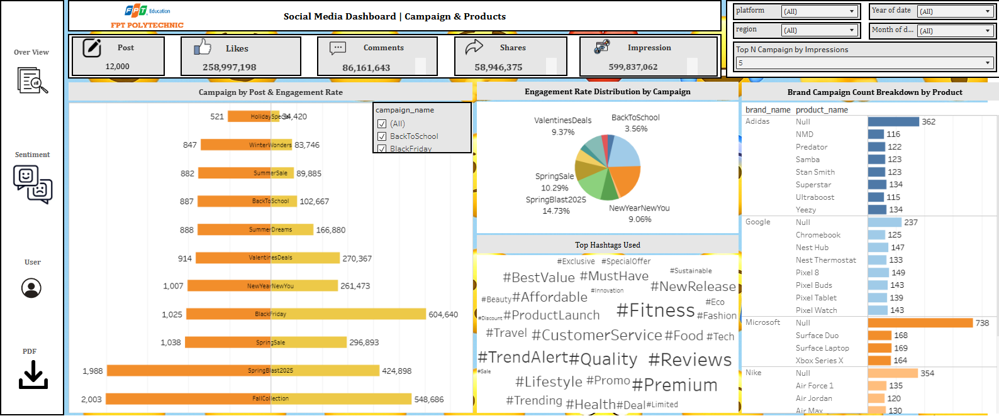
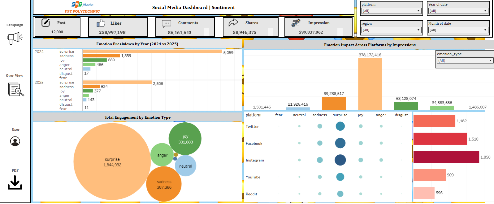
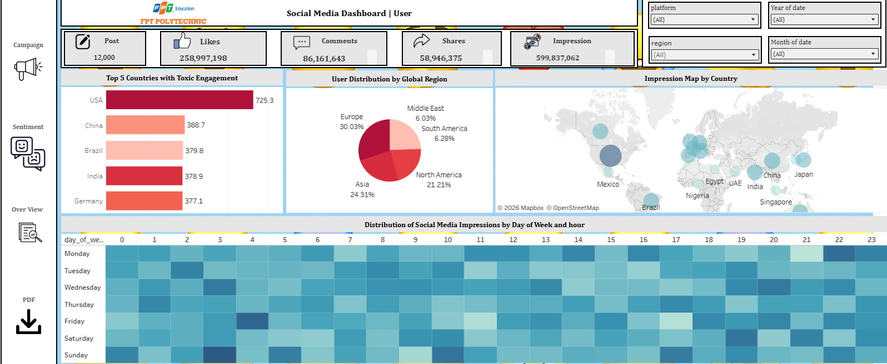

# 📱 Social Media Engagement Analysis | Python, SQL Server & Tableau

An end-to-end social media analytics project that combines **data engineering, sentiment analysis, SQL data modeling, and interactive Tableau dashboards** to evaluate campaign performance and generate actionable marketing insights.

---

# 📌 Project Overview

Social media has become one of the most influential channels for brand communication and customer engagement. However, marketing teams often struggle to measure campaign effectiveness and understand the factors that drive user interaction.

This project analyzes **12,000+ social media posts** across multiple platforms to uncover insights into:

- 😊 User sentiment
- 📈 Engagement behavior
- 📢 Campaign performance
- #️⃣ Hashtag effectiveness
- 🌍 Geographic audience distribution

The goal is to transform raw social media data into meaningful business insights that support data-driven marketing decisions.

---

# 💼 Business Problem

Marketing teams need answers to questions such as:

- Which platform generates the highest engagement?
- What emotions drive stronger audience interaction?
- Which campaigns deliver the best performance?
- How do hashtags influence reach and impressions?
- Which regions contribute the highest engagement?

This project addresses these challenges through data analytics, NLP, SQL modeling, and interactive dashboards.

---

# ⭐ Project Highlights

- 📊 Analyzed **12,000+ social media posts**
- 🤖 Built a **BERT-based sentiment analysis pipeline**
- 🗄️ Designed a **Snowflake Schema** in SQL Server
- 📈 Developed **4 interactive Tableau dashboards**
- ❤️ Identified **73.59% Positive Sentiment**
- 📱 Found Instagram to be the highest-performing platform

---

# 🛠 Tech Stack

### 🐍 Programming

- Python
- Pandas
- NumPy

### 🤖 NLP & Machine Learning

- BERT
- Hugging Face Transformers
- PyTorch

### 🗄 Database

- SQL Server
- T-SQL

### 📊 Data Visualization

- Tableau

---

# 🔄 Project Workflow

```text
Raw CSV Data
      │
      ▼
Data Cleaning & Transformation
      │
      ▼
Text Preprocessing
      │
      ▼
BERT Sentiment Classification
      │
      ▼
SQL Server Data Modeling
      │
      ▼
T-SQL Analytics
      │
      ▼
Interactive Tableau Dashboard
```

---

# ⚙ Data Preparation

The preprocessing workflow included:

- Cleaning missing values
- Standardizing timestamps
- Extracting hashtags and mentions
- Mapping language codes
- Splitting locations into country and region
- Identifying brands and products
- Calculating engagement rates

---

# 🤖 Sentiment Analysis

A BERT-based NLP pipeline was developed to classify both **emotion** and **overall sentiment**.

### Emotion Categories

- 😊 Joy
- 😢 Sadness
- 😠 Anger
- 😨 Fear
- 😲 Surprise
- 🤢 Disgust
- 😳 Shame

### Sentiment Labels

- Positive
- Neutral
- Negative

---

# 🗄 Database Design

A **Snowflake Schema** was implemented to improve scalability and analytical performance.

### Core Tables

- Users
- Posts
- Campaigns
- Brands
- Products
- Analytics

---

# 📊 Dashboard Preview

The Tableau report consists of **4 interactive dashboards**.

---

## 📌 1. Overview Dashboard



### Key Metrics

- 📄 Total Posts: **12,000**
- ❤️ Total Likes: **258M+**
- 💬 Total Comments: **86M+**
- 🔄 Total Shares: **58M+**
- 👀 Total Impressions: **599M+**

### Business Insight

Instagram achieved the highest average engagement across all platforms.

---

## 📌 2. Campaign Performance Dashboard



### Analysis Includes

- Campaign engagement
- Product performance
- Campaign comparison
- Audience interaction

### Business Insight

Black Friday generated the strongest engagement, demonstrating the effectiveness of urgency-driven campaigns.

---

## 📌 3. Sentiment Analysis Dashboard



### Analysis Includes

- Emotion distribution
- Sentiment breakdown
- Impression analysis
- Engagement comparison

### Business Insight

Positive sentiment accounted for **73.59%** of all posts and produced the highest engagement.

---

## 📌 4. User Behavior Dashboard



### Analysis Includes

- Regional engagement
- User activity
- Toxic interaction analysis
- Geographic distribution

### Business Insight

North America and Europe generated the highest engagement, while toxic interactions were most concentrated in the USA.

---

# 💡 Key Business Insights

### 📱 Platform Performance

- Instagram achieved the highest engagement rate.
- Facebook ranked second in total interactions.

### 😊 Sentiment Analysis

- Positive sentiment represented **73.59%** of all posts.
- Joy-based content generated the highest impressions.

### 📢 Campaign Performance

Top-performing campaigns:

- Black Friday
- Fall Collection
- SpringBlast2025

Black Friday significantly outperformed other campaigns due to urgency-driven consumer behavior.

### 🌍 User Behavior

- Highest engagement originated from North America and Europe.
- Toxic interactions were significantly higher in the USA.

### #️⃣ Hashtag Effectiveness

Trending hashtags increased content visibility by approximately **20%**.

---

# 🎯 Business Recommendations

Based on the analysis:

- Prioritize Instagram for engagement-focused campaigns.
- Create content with positive emotional framing.
- Invest in seasonal campaigns such as Black Friday.
- Optimize hashtag strategies to maximize impressions.
- Monitor negative sentiment to reduce brand reputation risks.

---

# 🚀 Skills Demonstrated

- Data Cleaning & Transformation
- Natural Language Processing (NLP)
- Sentiment Analysis
- SQL Query Optimization
- Snowflake Data Modeling
- Exploratory Data Analysis (EDA)
- Tableau Dashboard Development
- Business Intelligence
- Marketing Analytics
- Data Storytelling

---

# 📁 Repository Structure

```text
social-media-engagement-analysis/
│
├── data/
├── notebooks/
├── dashboard/
│   ├── dashboard_images/
│
├── README.md
├── requirements.txt
└── .gitignore
```

---

# 🔮 Future Enhancements

Potential future improvements include:

- 🌐 Collect Real-World Data
- 🤖 Enhance Sentiment Model
- 🔄 Real-Time API Integration
- 🌍 Multilingual Prediction

